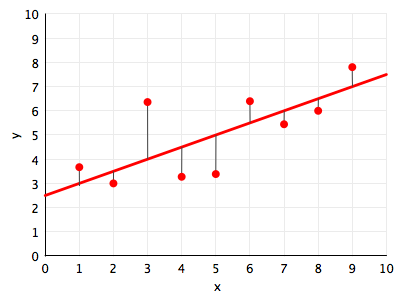
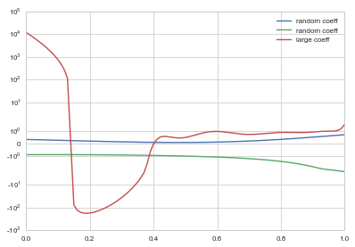
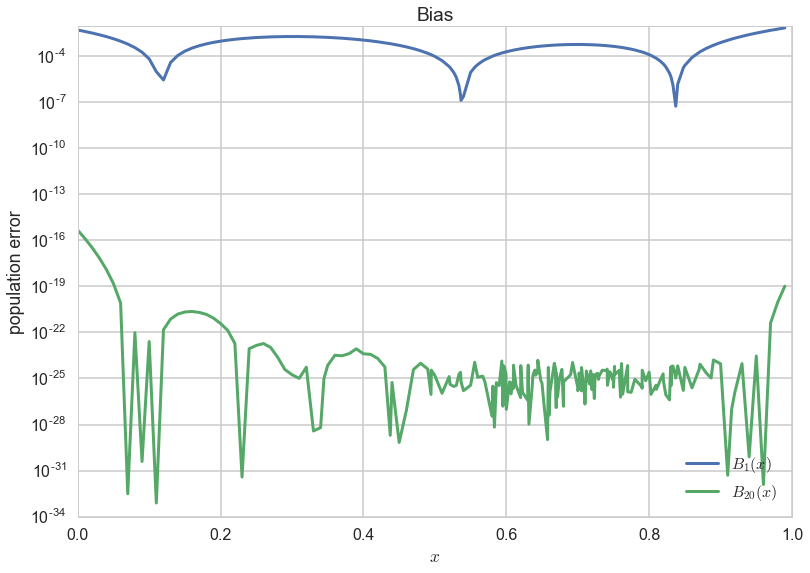
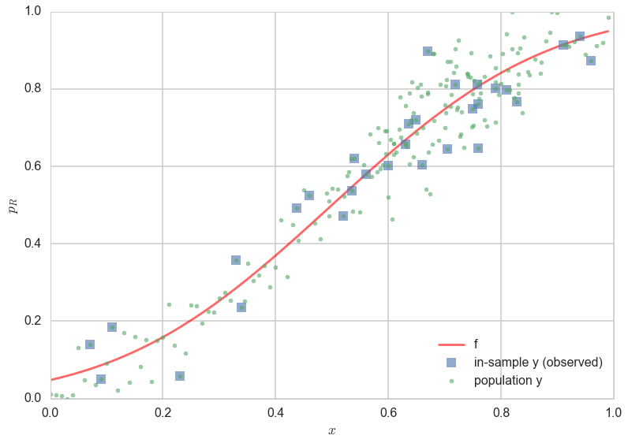
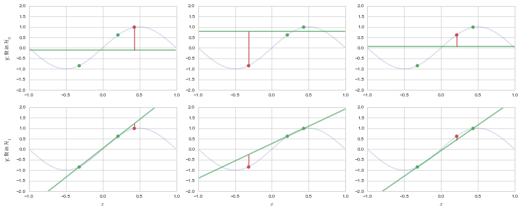
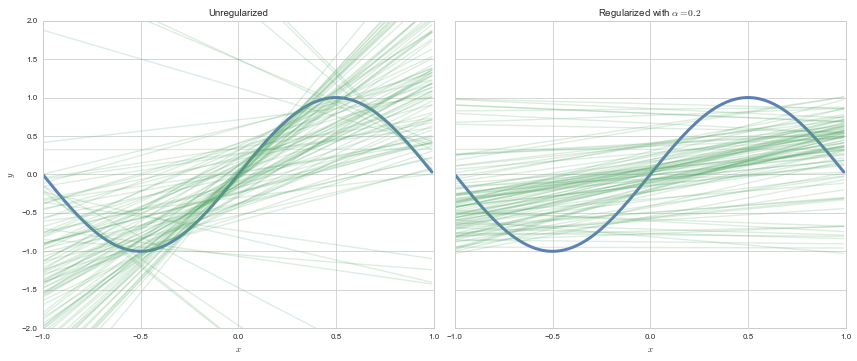
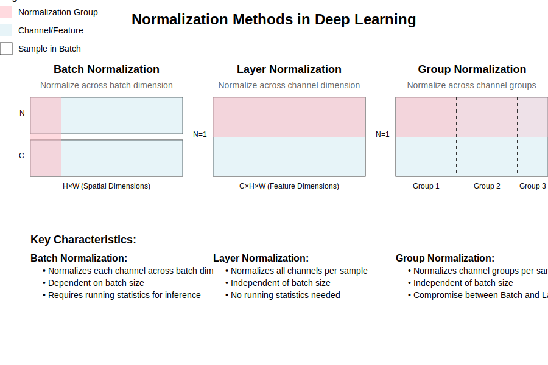
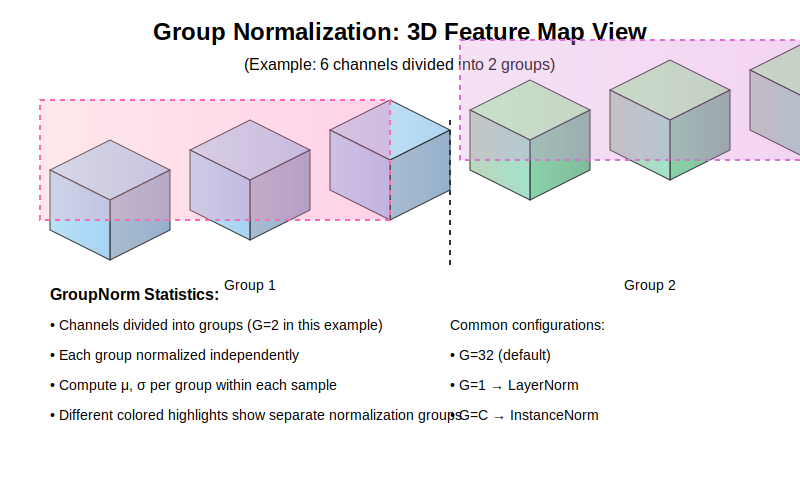

footer: Hult University, Rahul Dave
autoscale: true

#[fit] The Basic Concepts
#[fit] of Machine Learning
## Bias, Variance, Complexity, and Regularization

###[fit] [https://github.com/hultml/ElementsOfLearning](https://github.com/hultml/ElementsOfLearning)

### Rahul Dave

---


#[fit] A. Learning a Model

### (of the right complexity)


---



#[fit]RISK: What does it mean to FIT?

Minimize distance from the line?

$$R_{\cal{D}}(h_1(x)) = \frac{1}{N} \sum_{y_i \in \cal{D}} (y_i - h_1(x_i))^2 $$

Minimize squared distance from the line.

$$ g_1(x) = \arg\min_{h_1(x) \in \cal{H_1}} R_{\cal{D}}(h_1(x)).$$

##[fit]Get intercept $$w_0$$ and slope $$w_1$$.

---



#[fit] HYPOTHESIS SPACES

For example, a polynomial looks so:

 $$h(x) = \theta_0 + \theta_1 x^1 + \theta_2 x^2 + ... + \theta_n x^n = \sum_{i=0}^{n} \theta_i x^i$$

All polynomials of a degree or complexity $$d$$ constitute a hypothesis space.

$$ \cal{H}_1: h_1(x) = \theta_0 + \theta_1 x $$
$$ \cal{H}_{20}: h_{20}(x) = \sum_{i=0}^{20} \theta_i x^i$$

---

#[fit] 1. Approximation

## Learning Without Noise...

---


## Constructing a sample from a population

Well usually you are only given a sample. What is it?

Its a set of $$(x, y)$$ points chosen from the population.

If you had the population you could construct many samples of a smaller size by randomly choosing subsamples of such points.

This is a game we will play...

---

A sample of 30 points of data. Which fit is better? Line in $$\cal{H_1}$$ or curve in $$\cal{H_{20}}$$?


---

# Bias or Mis-specification Error




---


#[fit] 2. THE REAL WORLD
#[fit] HAS NOISE

### (or finite samples, usually both)


---



---

#Statement of the Learning Problem

The sample must be representative of the population!


$$A : R_{\cal{D}}(g) \,\,smallest\,on\,\cal{H}$$
$$B : R_{out} (g) \approx R_{\cal{D}}(g)$$


A: In-sample risk is small
B: Population, or out-of-sample risk is WELL estimated by in-sample risk. Thus the out of sample risk is also small.

---

Which fit is better now?
                                              The line or the curve?


---


## Training sets


- look at fits on different "training sets $${\cal D}$$"
- in other words, different samples
- in real life we are not so lucky, usually we get only one sample
- but lets pretend, shall we?

---

#UNDERFITTING (Bias) vs OVERFITTING (Variance)


---

##[fit] 3. Complexity
##[fit] amongst Models

---

# How do we estimate

# out-of-sample or population error $$R_{out}$$


#TRAIN AND TEST


---


# MODEL COMPARISON: A Large World approach

- want to choose which Hypothesis set is best
- it should be the one that minimizes risk
- but minimizing the training risk tells us nothing: interpolation
- we need to minimize the training risk but not at the cost of generalization
- thus only minimize till test set risk starts going up


---

## Complexity Plot


---

DATA SIZE MATTERS: straight line fits to a sine curve


Corollary: Must fit simpler models to less data! This will motivate the analysis of learning curves later.

---

##[fit]4. Validation


---

##[fit] Do we still have a test set?

Trouble:

- we dont have the error bars on our risk estimate
- "visually fitting" a value of $$d \implies$$ **contaminated** test set.

The moment we **use a set in the learning process, it is not a test set**. The risk
estimated on the test set now underestimates the risk on the population.

---


#[fit]VALIDATION

- train-test not enough as we *fit* for $$d$$ on test set and contaminate it
- thus do train-validate-test


---


### We want to find complexity (a hyperparameter):

- we **wrongly** already attempted to fit $$d$$ on our previous test set.
- choose instead the $$d^*, g^{-*}$$ combination with the lowest validation set risk.
- $$R_{val}(g^{-*}, d^*)$$ has an optimistic bias since $$d$$ effectively fit on validation set

### Then Retrain on entire set!

- finally retrain on the entire train+validation set using the appropriate  $$d^*$$ . This gives us $$g^{*}$$ (its a different model!) . Why? We want to finally compute error on the held out test set and..
- works as training for a given hypothesis space with more data typically reduces the risk even further.

---

### Whats the problem?

What if we, just by chance had an iffy validation set? What if the data was spead out?



---

We then do

##[fit] 5. Cross-Validation

---

## Cross Validation

Key Idea: Repeat the validation process on different pieces of left out data. Make these left-out parts not overlap so that the risks/errors/mse calculated on each are not correlated. Average the multiple validation errors. Use this error estimate like before...to choose the right complexity.


---

## Validation to Cross Validation


---


#[fit]CROSS-VALIDATION

- robust to outlier validation set
- allows for computing standard deviation on risk estimates
- validation process as one that estimates $$R_{out}$$ directly, on the validation set. It's critical use is in the model selection process.
- once you do that you can estimate $$R_{out}$$ using the test set as usual, but now you have also got the benefit of a robust average and error bars.
- key subtlety: in the risk averaging process, you are actually averaging over different $$g^-$$ models, with different parameters.

---

Consider instead choosing a Hypothesis set that includes very complex models, and then find a way to subset this set. This method is called

##[fit] B. Regularization

---

## REGULARIZATION

Keep higher a-priori complexity and impose a

##complexity penalty

on risk instead, to choose a SUBSET of $$\cal{H}_{big}$$.

We'll make the coefficients small: $$\sum_{i=0}^m \theta_i^2 < C.$$

---



---


## ok so now how do we do

#[fit]REGULARIZATION

$$\cal{R}(h_j) =  \sum_{y_i \in \cal{D}} (y_i - h_j(x_i))^2 +\lambda \sum_{i=0}^j \theta_i^2.$$

As we increase $$\lambda$$, coefficients go towards 0.

Lasso uses $$\lambda \sum_{i=0}^j |\theta_i|,$$ sets coefficients to exactly 0.


---

## Lasso vs Ridge Geometry


---


## Structural Risk Minimization

- Regularization is a subsetting now,
- of a complex hypothesis set.
- If you subset too much, you underfit
- but if you do not do it enough, you overfit

---

## Regularization with Cross-Validation


---

##[fit] C. Regularization in Deep Learning

---

# Why Regularization?

- Neural networks are powerful function approximators
- With great power comes great ~~responsibility~~ overfitting
- Need methods to constrain model complexity
- Goal: Better generalization to unseen data
- Open Research Question: Why can Neural Networks generalize so well despite overfitting?

^ This is where we'll begin our journey into regularization techniques

---

# Common Regularization Techniques

1. **Parameter Norm Penalties**
   - L1 regularization (Lasso)
   - L2 regularization (Ridge)

2. **Noise Robustness**
   - Dropout
   - DropConnect

3. **Normalization Methods**
   - Batch Normalization
   - Layer Normalization
   - Group Normalization

4. **Data-based Methods**
   - Data Augmentation
   - Mixup
   - Cutout

---

# L1 & L2 Regularization

### L1 (Lasso):
- Adds |w| to loss
- Promotes sparsity
- Feature selection

### L2 (Ridge):
- Adds w² to loss
- Prevents large weights
- Smooth solutions

---

# Dropout: The Concept

- Randomly "drops" neurons during training
- Each neuron has probability p of being retained
- Forces network to learn redundant representations
- Acts like model ensemble at test time

---


---
```python
import torch
import torch.nn as nn

class SimpleNetWithDropout(nn.Module):
    def __init__(self, input_size=784, hidden_size=256, output_size=10, dropout_prob=0.5):
        super().__init__()
        self.layer1 = nn.Linear(input_size, hidden_size)
        self.dropout = nn.Dropout(p=dropout_prob)  # dropout probability of 0.5
        self.layer2 = nn.Linear(hidden_size, output_size)
        self.relu = nn.ReLU()

    def forward(self, x):
        # First layer
        x = self.layer1(x)
        x = self.relu(x)

        # Dropout layer - behavior changes based on self.training
        x = self.dropout(x)  # During training: randomly zeros some elements
                            # During eval: scales by (1-dropout_prob)

        # Output layer
        x = self.layer2(x)
        return x
```

---
[.column]
```python
# Create model and sample input
model = SimpleNetWithDropout()
sample_input = torch.randn(1, 784)  # one sample of 784 features

# Run the same input multiple times to show randomness
for i in range(3):
    with torch.no_grad():  # Just for demonstration
        output = model(sample_input)
        # Count non-zero activations after dropout
        after_dropout = model.dropout(torch.ones(256))  # Check dropout pattern
        active_neurons = torch.sum(after_dropout > 0).item()
        print(f"Forward pass {i+1}: {active_neurons}/256 neurons active")

# Evaluation mode demonstration
model.eval()  # Set to evaluation mode
print("\nEvaluation Mode:")
print("-" * 50)

# Run the same input multiple times to show deterministic behavior
for i in range(3):
    with torch.no_grad():
        output = model(sample_input)
        # In eval mode, dropout is disabled and acts as identity function with scaling
        after_dropout = model.dropout(torch.ones(256))
        active_neurons = torch.sum(after_dropout > 0).item()
        print(f"Forward pass {i+1}: {active_neurons}/256 neurons active")
```

[.column]

```python
# Example training loop
def train_step(model, optimizer, criterion, x, y):
    model.train()  # Enable dropout
    optimizer.zero_grad()
    output = model(x)
    loss = criterion(output, y)
    loss.backward()
    optimizer.step()

# Example evaluation
def evaluate(model, x):
    model.eval()  # Disable dropout
    with torch.no_grad():
        return model(x)
```

---


---

# Normalization Methods

1. **Batch Norm**
   - Normalizes across batch dimension
   - Batch statistics can be unstable

2. **Layer Norm**
   - Normalizes across feature dimension
   - Independent of batch size

3. **Group Norm**
   - Middle ground between Batch and Layer Norm
   - Divides channels into groups

---



---


## Batch Normalization:

- Normalizes across the batch dimension (N) for each channel
- The statistics (mean, variance) are computed across all samples in the batch for each feature channel


---

For each channel c, where: N: batch size, C: channels, H,W: height, width; γ, β: learnable parameters; ε: small constant for numerical stability

[.column]


$$\mu_{c} = \frac{1}{NHW} \sum_{n=1}^N \sum_{h=1}^H \sum_{w=1}^W x_{nchw}$$

$$\sigma_{c}^2 = \frac{1}{NHW} \sum_{n=1}^N \sum_{h=1}^H \sum_{w=1}^W (x_{nchw} - \mu_c)^2$$

$$\hat{x}_{nchw} = \frac{x_{nchw} - \mu_c}{\sqrt{\sigma_c^2 + \epsilon}}$$

$$y_{nchw} = \gamma_c \hat{x}_{nchw} + \beta_c$$


[.column]


```python
import torch
import torch.nn as nn

# Basic usage
bn = nn.BatchNorm2d(
    num_features=64,  # number of channels
    eps=1e-5,        # numerical stability
    momentum=0.1,    # running stats momentum
    affine=True      # learnable γ, β
)

# In a model
class ConvBatchNorm(nn.Module):
    def __init__(self, in_channels, out_channels):
        super().__init__()
        self.conv = nn.Conv2d(in_channels,
                             out_channels,
                             kernel_size=3)
        self.bn = nn.BatchNorm2d(out_channels)

    def forward(self, x):
        x = self.conv(x)
        x = self.bn(x)  # normalize each channel
        return x
```

---


## Layer Normalization:

- Normalizes across all channels (C) and spatial dimensions (H×W) for each sample
- Statistics are computed independently for each sample
- No batch dependency

---

[.column]

$$\mu_n = \frac{1}{CHW} \sum_{c=1}^C \sum_{h=1}^H \sum_{w=1}^W x_{nchw}$$

$$\sigma_n^2 = \frac{1}{CHW} \sum_{c=1}^C \sum_{h=1}^H \sum_{w=1}^W (x_{nchw} - \mu_n)^2$$

$$\hat{x}_{nchw} = \frac{x_{nchw} - \mu_n}{\sqrt{\sigma_n^2 + \epsilon}}$$

$$y_{nchw} = \gamma \hat{x}_{nchw} + \beta$$

for each sample n, and where:
- Statistics computed per sample
- Single γ, β per normalized shape
- Independent of batch size

[.column]

```python
import torch
import torch.nn as nn

# Basic usage
ln = nn.LayerNorm(
    normalized_shape=[64, 32, 32],  # C,H,W
    eps=1e-5,
    elementwise_affine=True  # learnable γ, β
)

# In a model (e.g., Transformer)
class TransformerLayerNorm(nn.Module):
    def __init__(self, hidden_size=512):
        super().__init__()
        self.ln = nn.LayerNorm(hidden_size)

    def forward(self, x):
        # x shape: [batch, seq_len, hidden_size]
        return self.ln(x)

# For CNNs (uncommon but possible)
class ConvLayerNorm(nn.Module):
    def __init__(self, num_channels, height, width):
        super().__init__()
        self.ln = nn.LayerNorm([num_channels,
                               height,
                               width])

    def forward(self, x):
        # Normalize each sample independently
        return self.ln(x)
```

---



## Group Normalization:

- Middle ground between Batch and Layer Norm
- Channels are divided into groups (shown by dashed lines)
- Each group is normalized independently
- Works well with small batch sizes

---
[.column]

$$\mu_{ng} = \frac{1}{CHW/G} \sum_{c \in \mathcal{G}_g} \sum_{h=1}^H \sum_{w=1}^W x_{nchw}$$

$$\sigma_{ng}^2 = \frac{1}{CHW/G} \sum_{c \in \mathcal{G}_g} \sum_{h=1}^H \sum_{w=1}^W (x_{nchw} - \mu_{ng})^2$$

$$\hat{x}_{nchw} = \frac{x_{nchw} - \mu_{ng}}{\sqrt{\sigma_{ng}^2 + \epsilon}}$$

$$y_{nchw} = \gamma_c \hat{x}_{nchw} + \beta_c$$

for each sample n and group g, and where:
- G: number of groups
- 𝒢g: channels in group g
- Statistics computed per group
- Independent of batch size

[.column]

```python
import torch
import torch.nn as nn

# Basic usage
gn = nn.GroupNorm(
    num_groups=8,      # number of groups
    num_channels=64,   # total channels
    eps=1e-5,
    affine=True       # learnable γ, β
)

# In a model
class ConvGroupNorm(nn.Module):
    def __init__(self, in_channels, out_channels,
                 groups=8):
        super().__init__()
        self.conv = nn.Conv2d(in_channels,
                             out_channels,
                             kernel_size=3)
        self.gn = nn.GroupNorm(
            num_groups=groups,
            num_channels=out_channels
        )

    def forward(self, x):
        x = self.conv(x)
        x = self.gn(x)  # normalize each group
        return x

# Common configurations
# ResNet-style: num_channels = 32 × groups
model = ConvGroupNorm(64, 256, groups=8)
```

---

### How Normalization Layers Regularize

[.column]
#### BatchNorm

##### Direct Effects:
- **Noise Injection**: Each mini-batch provides slightly different statistics
- **Covariate Shift Reduction**: Stabilizes hidden layer distributions
- **Implicit Learning Rate Adaptation**: Effective learning rate varies with batch statistics

##### Indirect Effects:
- **Smoother Loss Landscape**: Normalization makes optimization landscape more well-behaved
- **Weight Decay Interaction**: Changes the effective weight decay based on activation magnitudes
- **Gradient Predictiveness**: Improves correlation between gradients across iterations

[.column]
#### LayerNorm

##### Direct Effects:
- **Scale Invariance**: Makes each sample's representation independent of its scale
- **Feature Competition**: Forces features to compete within each normalization group
- **Gradient Flow**: Helps prevent vanishing/exploding gradients

##### Indirect Effects:
- **Architecture Regularization**: Constrains the function space of the network
- **Adaptive Learning**: Different features can learn at different rates

[.column]
#### GroupNorm

##### Direct Effects:
- **Balanced Feature Groups**: Creates competition within feature groups
- **Reduced Feature Co-adaptation**: Groups must learn complementary representations
- **Batch-Independent Regularization**: Consistent effect regardless of batch size

---

### The Pre/Post ReLU Controversy

[.column]
#### Arguments for Pre-ReLU (norm → ReLU)

1. **Original BatchNorm Paper's Approach**
   - Normalizes the full distribution before non-linearity
   - Claimed to reduce "internal covariate shift"
   - More theoretically aligned with whitening transforms

2. **Empirical Success**
   - Used successfully in many architectures (ResNet, etc.)
   - Well-studied optimization properties
   - More stable training in many cases

[.column]
#### Arguments for Post-ReLU (ReLU → norm)

1. **Distribution Preservation**
   - ReLU creates a clean sparse distribution
   - Normalization preserves sparsity pattern
   - More interpretable statistics

2. **Recent Research Findings**
   - May provide better gradient flow
   - Can lead to faster convergence
   - More stable feature statistics

## Real-World Impact

### Pre-ReLU Benefits:
- More common in practice
- Better understood theoretically
- Often easier to initialize correctly

### Post-ReLU Benefits:
- Can be more compute efficient
- May preserve useful sparsity
- Sometimes better performance in modern architectures

---

## General Practical Recommendations

1. **Default Choice**:
  Start with Pre-ReLU (norm → ReLU). This is the most widely tested configuration

2. **When to Consider Post-ReLU**:
   - Very deep networks
   - When sparsity is important
   - Memory-constrained scenarios

3. **Architecture-Specific**:
   - CNNs: Pre-ReLU usually better
   - Transformers: Layer normalization positioning less critical
   - ResNets: Pre-activation variants use different patterns

4. **Empirical Testing**:
   - Always validate both on your specific task
   - Consider interaction with skip connections
   - Monitor gradient flow and training stability

---

# Data Augmentation

### Common Techniques:

- Geometric transformations
  - Rotation, scaling, flipping
- Color space transformations
  - Brightness, contrast, hue
- Random erasing/cutout
- Mixing methods (Mixup, CutMix)

---

# Best Practices

1. Start with basic techniques
   - L2 regularization
   - Dropout

2. Add normalization
   - BatchNorm for CNNs
   - LayerNorm for Transformers

3. Use data augmentation
   - Domain-specific augmentations
   - Test-time augmentation

---

## More Soon!
